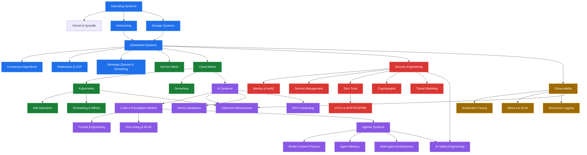
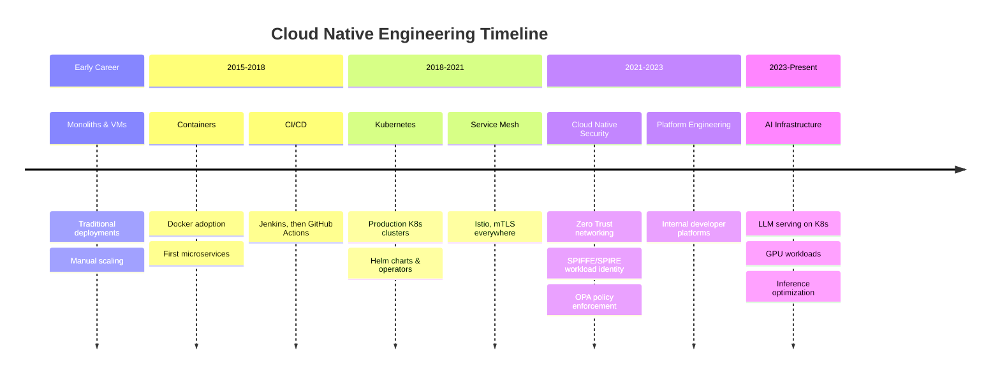
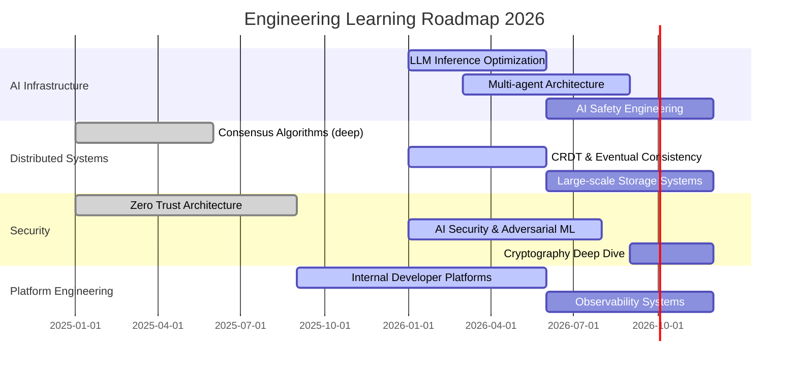
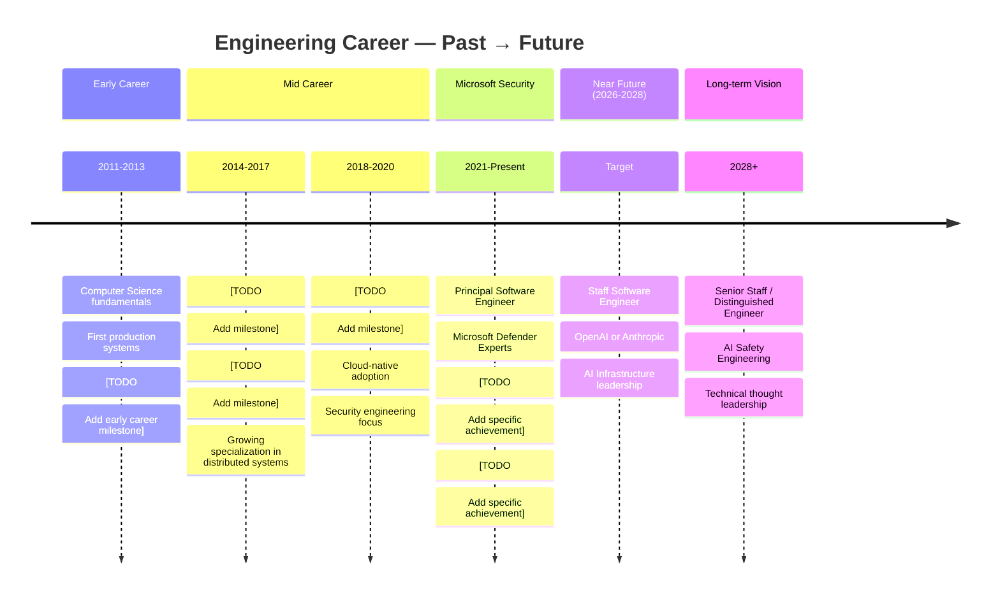

<!-- ============================================================
     DHAIRYA DEEPAK VORA — GitHub Profile README
     Principal Software Engineer @ Microsoft Security
     Evolving toward: AI Infrastructure · Distributed Systems · Agentic AI
     ============================================================ -->

<div align="center">

<!-- Typing animation via readme-typing-svg -->
[](https://git.io/typing-svg)

<br/>

<!-- Role badges -->


<br/>

<!-- Social / contact badges -->
[](https://linkedin.com/in/dhairyavora)
[](https://github.com/spDhairya)
[](https://github.com/spDhairya)

</div>

---

## 👋 Introduction

Hey — I'm **Dhairya**. I'm a Principal Software Engineer at **Microsoft Security**, currently building [Microsoft Defender Experts](https://www.microsoft.com/en-us/security/business/microsoft-defender-experts), a managed detection and response service that helps organizations hunt threats at scale.

I've been writing software professionally for **13+ years**, across domains including **distributed systems**, **cloud-native infrastructure**, **security engineering**, **identity**, and most recently **AI systems**. The common thread across all of it: I like understanding *why* systems fail, *how* they scale, and *what* makes them trustworthy.

> *If you're hiring for Staff or Senior Staff roles focused on AI infrastructure, platform engineering, or distributed systems — let's talk.*

---

## 🧠 Engineering Philosophy

<details>
<summary><b>Click to expand — how I think about building systems</b></summary>

<br/>

**On correctness over cleverness:**
The most impressive code I've ever read was boring. It was clear, predictable, and had zero surprises. I aim for that. Clever code is a liability — clear code is a gift to your future self and every teammate who follows.

**On failure as a design input:**
Every system will fail. The question is whether you designed for it. Chaos engineering, graceful degradation, circuit breakers, and observability are not optional — they're load-bearing walls.

**On abstractions:**
Good abstractions feel inevitable. Bad abstractions feel forced. When I find myself fighting an abstraction, that's usually a sign it was designed for a slightly different problem.

**On scale:**
Scale changes everything. A system that works perfectly at 10 requests/second will surprise you at 10,000. Design for 10x, validate assumptions at 100x, build in circuit breakers for 1000x.

**On security:**
Security is not a feature you bolt on at the end. Every trust boundary, every token, every credential, every API surface is a design decision. I think in threat models.

**On AI systems:**
LLMs are probabilistic, not deterministic. Treating them like traditional software is a mistake. Designing AI systems requires a different mental model — one where you accept uncertainty, invest heavily in evals, and make failure modes explicit.

**On teams:**
The best systems I've worked on were built by teams that argued loudly about ideas and were kind to each other. Technical quality and psychological safety are correlated, not opposed.

</details>

---

## ⚙️ Current Focus

```
┌─────────────────────────────────────────────────────────────────┐
│  CURRENT ENGINEERING FOCUS  (Updated: July 2026)                │
├──────────────────────┬──────────────────────────────────────────┤
│  Day Job             │  Microsoft Defender Experts              │
│                      │  Threat detection at cloud scale         │
│                      │  Platform reliability engineering        │
├──────────────────────┼──────────────────────────────────────────┤
│  Deep Study          │  LLM Infrastructure & Inference Systems  │
│                      │  Multi-agent Architectures (MCP, A2A)    │
│                      │  AI Safety & Evaluation Frameworks       │
├──────────────────────┼──────────────────────────────────────────┤
│  Side Projects       │  [TODO: Add active side project 1]       │
│                      │  [TODO: Add active side project 2]       │
├──────────────────────┼──────────────────────────────────────────┤
│  Currently Reading   │  [TODO: Add current book/paper]          │
│                      │  [TODO: Add current paper]               │
└──────────────────────┴──────────────────────────────────────────┘
```

---

## 🚀 Long-term Vision

I'm building toward becoming an **engineering leader in modern AI infrastructure** — specifically at the intersection of:

- **Reliable distributed systems** that can serve AI workloads at scale
- **Agentic AI architectures** that are safe, observable, and production-hardened
- **Security engineering** for AI systems (adversarial robustness, prompt injection, secrets management in agentic pipelines)
- **Platform engineering** that makes other engineers dramatically more productive

The goal isn't just to build things that work — it's to build things that *keep* working, that other engineers can reason about, and that degrade gracefully under conditions no one predicted.

Longer term, I want to contribute to the infrastructure layer that makes **trustworthy AI systems** possible at scale. The hard problems in AI aren't just model quality — they're reliability, observability, security, and alignment of the systems *around* the models.

---

## 🛰 Knowledge Graph

The domains I work across are more connected than they appear. Here's a simplified view of how I think about the relationships:



---

## 📚 Technical Reading List

<details>
<summary><b>📘 Books</b></summary>

<br/>

**Distributed Systems & Infrastructure**

| Title | Author | Status | Notes |
|-------|--------|--------|-------|
| Designing Data-Intensive Applications | Martin Kleppmann | ✅ Read | Essential. The chapter on replication alone is worth the price. |
| Systems Performance | Brendan Gregg | 📖 In Progress | [TODO: Add notes] |
| Database Internals | Alex Petrov | 📖 In Progress | [TODO: Add notes] |
| The Linux Programming Interface | Michael Kerrisk | 🔖 Backlog | [TODO: Add notes] |
| Computer Networks: A Systems Approach | Peterson & Davie | 🔖 Backlog | [TODO: Add notes] |
| [TODO: Add book] | [TODO] | 🔖 Backlog | |

**AI & Machine Learning Systems**

| Title | Author | Status | Notes |
|-------|--------|--------|-------|
| Designing Machine Learning Systems | Chip Huyen | ✅ Read | [TODO: Add notes] |
| Building LLMs for Production | [TODO] | 📖 In Progress | [TODO: Add notes] |
| [TODO: Add book] | [TODO] | 🔖 Backlog | |

**Security Engineering**

| Title | Author | Status | Notes |
|-------|--------|--------|-------|
| The Web Application Hacker's Handbook | Stuttard & Pinto | ✅ Read | [TODO: Add notes] |
| Threat Modeling: Designing for Security | Adam Shostack | ✅ Read | [TODO: Add notes] |
| Zero Trust Networks | Gilman & Barth | 📖 In Progress | [TODO: Add notes] |
| [TODO: Add book] | [TODO] | 🔖 Backlog | |

**Software Engineering & Leadership**

| Title | Author | Status | Notes |
|-------|--------|--------|-------|
| A Philosophy of Software Design | John Ousterhout | ✅ Read | [TODO: Add notes] |
| Staff Engineer | Will Larson | ✅ Read | [TODO: Add notes] |
| An Elegant Puzzle | Will Larson | 📖 In Progress | [TODO: Add notes] |
| [TODO: Add book] | [TODO] | 🔖 Backlog | |

</details>

<details>
<summary><b>📄 Research Papers I Keep Returning To</b></summary>

<br/>

| Paper | Year | Area | Why It Matters |
|-------|------|------|----------------|
| [Dynamo: Amazon's Highly Available Key-Value Store](https://www.allthingsdistributed.com/files/amazon-dynamo-sosp2007.pdf) | 2007 | Distributed Systems | Defined modern eventual consistency thinking |
| [The Google File System](https://static.googleusercontent.com/media/research.google.com/en//archive/gfs-sosp2003.pdf) | 2003 | Storage | Blueprint for large-scale distributed storage |
| [MapReduce: Simplified Data Processing on Large Clusters](https://static.googleusercontent.com/media/research.google.com/en//archive/mapreduce-osdi04.pdf) | 2004 | Distributed Computing | The paper that started the big data wave |
| [Raft: In Search of an Understandable Consensus Algorithm](https://raft.github.io/raft.pdf) | 2014 | Consensus | The clearest explanation of distributed consensus |
| [Attention Is All You Need](https://arxiv.org/abs/1706.03762) | 2017 | AI | The transformer paper — everything flows from here |
| [Scaling Laws for Neural Language Models](https://arxiv.org/abs/2001.08361) | 2020 | AI | Understanding how models scale with compute |
| [SPIFFE: Solving the Bottom Turtle](https://spiffe.io/book/) | 2020 | Security | Workload identity for cloud-native systems |
| [TODO: Add favorite paper] | — | — | |
| [TODO: Add favorite paper] | — | — | |

</details>

<details>
<summary><b>🌐 Blogs & Resources I Follow</b></summary>

<br/>

**Engineering Blogs**
- [The Pragmatic Engineer](https://newsletter.pragmaticengineer.com/) — best engineering newsletter in existence
- [Martin Fowler's Blog](https://martinfowler.com/) — architecture patterns, refactoring, enterprise design
- [Brendan Gregg's Blog](https://www.brendangregg.com/) — performance engineering at extreme depth
- [High Scalability](http://highscalability.com/) — real-world architecture case studies
- [AWS Architecture Blog](https://aws.amazon.com/blogs/architecture/)
- [Google Research Blog](https://research.google/blog/)
- [Anthropic Research](https://www.anthropic.com/research)
- [OpenAI Research](https://openai.com/research)
- [TODO: Add blog]
- [TODO: Add blog]

**Security**
- [Krebs on Security](https://krebsonsecurity.com/)
- [Project Zero Blog](https://googleprojectzero.blogspot.com/)
- [Trail of Bits Blog](https://blog.trailofbits.com/)
- [TODO: Add security blog]

**Newsletters**
- [ByteByteGo](https://bytebytego.com/) — system design
- [TLDR](https://tldr.tech/) — daily tech news
- [TODO: Add newsletter]

</details>

---

## 📄 White Paper Reviews

<details>
<summary><b>Click to expand — papers I've reviewed in depth</b></summary>

<br/>

> Each entry follows the format: Paper → Key insight → Production relevance

**[TODO: Add paper review 1]**
- *Key insight:* [TODO]
- *Production relevance:* [TODO]
- *Repo:* [paper-reviews →](https://github.com/spDhairya/paper-reviews)

**[TODO: Add paper review 2]**
- *Key insight:* [TODO]
- *Production relevance:* [TODO]

**[TODO: Add paper review 3]**
- *Key insight:* [TODO]
- *Production relevance:* [TODO]

---

*Full paper review notes live in [📁 paper-reviews](https://github.com/spDhairya/paper-reviews)*

</details>

---

## 📖 Book Reviews

<details>
<summary><b>Click to expand — engineering books worth your time</b></summary>

<br/>

**Designing Data-Intensive Applications** — Martin Kleppmann  
★★★★★ Essential reading for anyone building distributed systems. Chapter 5 on replication alone changed how I reason about consistency. The section on stream processing is still the clearest explanation I've found.  
*Best for:* Anyone building services that touch databases, queues, or distributed state.

**Staff Engineer: Leadership Beyond the Management Track** — Will Larson  
★★★★☆ Practical and honest. Less about techniques, more about the shift in how you should think about impact. The "staff archetypes" framework is genuinely useful for self-assessment.  
*Best for:* Senior engineers thinking about long-term career trajectory.

**[TODO: Add book review]**  
*Rating:* [★★★★★]  
*Notes:* [TODO]

**[TODO: Add book review]**  
*Rating:* [★★★★☆]  
*Notes:* [TODO]

</details>

---

## 📝 Technical Writing

<details>
<summary><b>Writing I've published or am working on</b></summary>

<br/>

| Title | Status | Area | Link |
|-------|--------|------|------|
| [TODO: Add article title] | 📝 Draft | Distributed Systems | [TODO] |
| [TODO: Add article title] | 📝 Draft | AI Infrastructure | [TODO] |
| [TODO: Add article title] | 📝 Draft | Security Engineering | [TODO] |
| [TODO: Add article title] | ✅ Published | [TODO] | [TODO] |

*I write about the things I wish had been documented better when I was learning them.*

</details>

---

## 🧪 Experiments

<details>
<summary><b>Things I'm tinkering with</b></summary>

<br/>

**Current experiments:**

- **[TODO: Experiment name]** — [TODO: Brief description of what you're exploring and why]
- **[TODO: Experiment name]** — [TODO: Brief description]
- **LLM routing experiments** — Exploring how to intelligently route prompts across different models based on task complexity, latency requirements, and cost constraints. [TODO: Link to repo]

*Not everything here ships. Some experiments are purely for understanding. I believe the best engineers have a lot of unfinished repositories.*

</details>

---

## 🛠 Side Projects

<details>
<summary><b>Things I build outside of work</b></summary>

<br/>

| Project | Description | Stack | Status |
|---------|-------------|-------|--------|
| [TODO: Project name] | [TODO: What it does and why you built it] | [TODO] | 🚧 In Progress |
| [TODO: Project name] | [TODO] | [TODO] | 🚀 Live |
| [TODO: Project name] | [TODO] | [TODO] | 💤 Dormant |

*Side projects are where I learn fastest. Work has constraints; side projects have only the constraints I choose.*

</details>

---

## 🏗 System Design Case Studies

<details>
<summary><b>System designs I've analyzed or implemented</b></summary>

<br/>

> These are architecture breakdowns of real systems — not interview prep. I write these to understand the *why* behind design decisions, not just the *what*.

**[TODO: System name — e.g., "How I'd design a distributed rate limiter"]**
- *Problem:* [TODO: Describe the problem]
- *Constraints:* [TODO: Throughput, latency, consistency requirements]
- *Design:* [TODO: High-level approach]
- *Tradeoffs:* [TODO: What you'd sacrifice for what you'd gain]
- *Diagram:* [TODO: Add Mermaid diagram or link]

**[TODO: System name]**
- *Problem:* [TODO]
- *Tradeoffs:* [TODO]

**[TODO: Production incident analysis]**
- [TODO: Describe an interesting production incident and what it revealed about system design]

---

*Full case studies live in [📁 system-design](https://github.com/spDhairya/system-design)*

</details>

---

## ☁️ Cloud Native Journey

<details>
<summary><b>My path through cloud-native engineering</b></summary>

<br/>



**Key milestones:**

- **[TODO: Add specific cloud-native milestone with year]**
- **[TODO: Add Kubernetes scale story]**
- **[TODO: Add interesting infrastructure war story]**

*Certifications: [TODO: Add relevant cloud certifications]*

</details>

---

## 🔒 Security Research

<details>
<summary><b>Security topics I study and explore</b></summary>

<br/>

**Areas of active focus:**

- **AI Security:** Prompt injection, adversarial robustness, jailbreaking vectors, supply chain risks for ML models
- **Zero Trust Architecture:** SPIFFE/SPIRE, workload identity, mutual TLS, policy as code
- **Secrets Management:** Vault patterns, secret rotation, credential hygiene in CI/CD pipelines
- **Identity Engineering:** OAuth 2.0, OIDC, JWT pitfalls, token scoping
- **Threat Modeling:** STRIDE, PASTA, attack trees for complex distributed systems

**Notable CVEs or Security Findings:**

| ID | Area | Status |
|----|------|--------|
| [TODO: Add CVE or finding] | [TODO] | [TODO] |

**Tooling I use for security research:**


*Notes and breakdowns: [📁 security-notes](https://github.com/spDhairya/security-notes) · [📁 cve-breakdowns](https://github.com/spDhairya/cve-breakdowns)*

</details>

---

## 🤖 AI Projects

<details>
<summary><b>AI and ML systems I've built or studied</b></summary>

<br/>

| Project | Description | Stack | Repo |
|---------|-------------|-------|------|
| [TODO: AI project name] | [TODO: What it does] | [TODO] | [Link] |
| [TODO: AI project name] | [TODO] | [TODO] | [Link] |

**What I'm thinking about in AI systems:**

- How do you build reliable evals when the output is probabilistic?
- How do you handle prompt injection at the infrastructure layer, not just the application layer?
- What does "observability" even mean for an LLM pipeline? Token probabilities? Attention patterns? Something else?
- How do you version-control prompts the same way you version-control code?

*Full AI project notes: [📁 agentic-ai](https://github.com/spDhairya/agentic-ai) · [📁 ai-infrastructure](https://github.com/spDhairya/ai-infrastructure)*

</details>

---

## 🧠 Agentic AI

<details>
<summary><b>My thinking on multi-agent systems and AI infrastructure</b></summary>

<br/>

Agentic AI is where I find the most interesting unsolved engineering problems right now. Not because the model capabilities are impressive (they are), but because the **infrastructure problems** are genuinely hard:

**Problems I'm actively thinking about:**

1. **Memory management for long-running agents** — How do you give an agent useful context without blowing through your context window? Episodic memory, semantic search over conversation history, or something else entirely?

2. **Reliable tool use** — Agents that call external tools introduce non-determinism at every step. How do you build reliable pipelines when any step can fail, retry, or return unexpected results?

3. **Multi-agent coordination** — When multiple agents collaborate on a task, how do you prevent them from working at cross-purposes? What does a "transaction" look like in a multi-agent system?

4. **Observability for agents** — Traditional tracing doesn't map well to agent loops. What does a useful trace look like for a 20-step agent execution?

5. **Security in agentic pipelines** — Prompt injection at scale is a genuinely novel attack surface. An agent with write access to production systems that can be hijacked via crafted input is terrifying.

**Protocols and frameworks I'm studying:**

- Model Context Protocol (MCP) — Anthropic's standard for tool-calling
- Agent-to-Agent (A2A) communication patterns
- LangGraph — for stateful agent workflows
- AutoGen — multi-agent frameworks
- OpenAI Assistants API architecture

*Related repos: [📁 agentic-ai](https://github.com/spDhairya/agentic-ai)*

</details>

---

## ⚡ Distributed Systems

<details>
<summary><b>Concepts, notes, and resources</b></summary>

<br/>

**Topics I understand deeply (and keep notes on):**

- **Consensus:** Raft, Paxos, Viewstamped Replication — the differences matter more than they appear
- **Replication:** Single-leader, multi-leader, leaderless — tradeoffs in consistency vs. availability
- **Partitioning:** Hash partitioning, range partitioning, consistent hashing — how data locality affects performance
- **Transactions:** ACID, MVCC, 2PC, Saga pattern — when each is appropriate
- **CRDTs:** Conflict-free replicated data types for eventually consistent systems
- **Time:** Logical clocks, vector clocks, TrueTime — why distributed time is philosophically interesting
- **Failure detection:** Gossip protocols, phi-accrual failure detectors, timeouts as design decisions
- **Back-pressure:** How to prevent a fast producer from overwhelming a slow consumer

**Systems I've studied in depth:**

| System | Key Property | Paper/Docs |
|--------|-------------|-----------|
| Kafka | Log-based messaging | [Original paper →](https://notes.stephenholiday.com/Kafka.pdf) |
| Cassandra | Leaderless replication | [Facebook paper →](https://www.cs.cornell.edu/projects/ladis2009/papers/lakshman-ladis2009.pdf) |
| Raft | Understandable consensus | [Raft paper →](https://raft.github.io/raft.pdf) |
| Zookeeper | Coordination service | [ZAB paper →](https://www.cs.cornell.edu/courses/cs6452/2012sp/papers/zab.pdf) |
| [TODO: Add system] | [TODO] | [TODO] |

*Full notes: [📁 distributed-systems](https://github.com/spDhairya/distributed-systems)*

</details>

---

## 🧩 Kubernetes Labs

<details>
<summary><b>K8s topics I've explored hands-on</b></summary>

<br/>

**Things I've built or debugged in Kubernetes:**

- Custom operators with `controller-runtime`
- Multi-cluster federation and workload placement
- Network policy enforcement with Cilium
- Workload identity with SPIFFE/SPIRE on K8s
- GPU workload scheduling for ML inference
- Cost optimization via right-sizing and spot instance strategies
- Admission webhooks for policy enforcement
- K8s API server extensions (CRDs, aggregated API servers)

**Active experiments:**

```yaml
# What I'm currently building in K8s
experiments:
  - name: "[TODO: Add experiment name]"
    goal: "[TODO: What are you trying to learn?]"
    status: in-progress
  - name: "[TODO: Add experiment name]"
    goal: "[TODO]"
    status: planned
```

*Lab notes: [📁 kubernetes-labs](https://github.com/spDhairya/kubernetes-labs)*

</details>

---

## 📈 Learning Roadmap



**Currently pursuing:**

- [ ] [TODO: Add specific certification or course]
- [ ] [TODO: Add paper or book goal]
- [ ] [TODO: Add project milestone]

---

## 🗺 Repository Navigator

> A map of repositories I maintain, organized by domain.

```
spDhairya/
├── 🧠  distributed-systems/    — Notes, experiments, and implementations
│                                  on consensus, replication, and storage
├── 📄  paper-reviews/          — In-depth breakdowns of CS and AI research papers
├── 🔒  security-notes/         — Security engineering, threat modeling, identity
├── 🔒  cve-breakdowns/         — CVE analyses and exploitation deep-dives
├── 🧩  kubernetes-labs/        — Hands-on K8s experiments and operator dev
├── 🤖  agentic-ai/             — Multi-agent architectures, MCP, memory systems
├── 🏗   system-design/          — Architecture case studies and design reviews
├── ☁️   cloud-native/           — Cloud-native patterns, GitOps, service mesh
├── 🚀  ai-infrastructure/      — LLM serving, inference optimization, GPU workloads
├── 🏗   architecture-patterns/  — Reusable patterns: circuit breakers, sagas, etc.
├── 📝  blog/                   — Technical articles and long-form writing
├── 📚  awesome-resources/      — Curated list of engineering resources by topic
└── 📓  learning-journal/       — Weekly learning logs and notes
```

| Repository | Purpose | Status |
|-----------|---------|--------|
| [distributed-systems](https://github.com/spDhairya/distributed-systems) | Deep-dive notes and implementations | 🚧 Building |
| [paper-reviews](https://github.com/spDhairya/paper-reviews) | CS paper breakdowns | 🚧 Building |
| [security-notes](https://github.com/spDhairya/security-notes) | Security engineering notes | 🚧 Building |
| [kubernetes-labs](https://github.com/spDhairya/kubernetes-labs) | K8s experiments | 🚧 Building |
| [agentic-ai](https://github.com/spDhairya/agentic-ai) | Agentic systems research | 🚧 Building |
| [system-design](https://github.com/spDhairya/system-design) | Architecture case studies | 🚧 Building |
| [ai-infrastructure](https://github.com/spDhairya/ai-infrastructure) | LLM infra experiments | 🚧 Building |
| [blog](https://github.com/spDhairya/blog) | Technical writing | 📝 Drafting |
| [learning-journal](https://github.com/spDhairya/learning-journal) | Weekly learning log | 🚧 Building |
| [awesome-resources](https://github.com/spDhairya/awesome-resources) | Curated resource lists | 🚧 Building |

---

## 💡 Things Engineering Has Taught Me

> Twenty-five lessons from 13+ years of building systems, debugging production, and working with teams.

1. **[TODO: Lesson 1]** — [TODO: One-sentence elaboration]
2. **[TODO: Lesson 2]** — [TODO]
3. **[TODO: Lesson 3]** — [TODO]
4. **[TODO: Lesson 4]** — [TODO]
5. **[TODO: Lesson 5]** — [TODO]
6. **[TODO: Lesson 6]** — [TODO]
7. **[TODO: Lesson 7]** — [TODO]
8. **[TODO: Lesson 8]** — [TODO]
9. **[TODO: Lesson 9]** — [TODO]
10. **[TODO: Lesson 10]** — [TODO]
11. **[TODO: Lesson 11]** — [TODO]
12. **[TODO: Lesson 12]** — [TODO]
13. **[TODO: Lesson 13]** — [TODO]
14. **[TODO: Lesson 14]** — [TODO]
15. **[TODO: Lesson 15]** — [TODO]
16. **[TODO: Lesson 16]** — [TODO]
17. **[TODO: Lesson 17]** — [TODO]
18. **[TODO: Lesson 18]** — [TODO]
19. **[TODO: Lesson 19]** — [TODO]
20. **[TODO: Lesson 20]** — [TODO]
21. **Operational clarity matters more than architectural elegance.** A beautifully designed system that nobody can debug at 2am is a liability.
22. **The best architecture review is a good postmortem.** Systems reveal their failure modes under production pressure, not in design documents.
23. **Reading the source code is almost always faster than reading the documentation.** The documentation describes intent; the source code describes reality.
24. **Every non-trivial system is eventually a distributed system.** Plan for the distributed case even when you start monolithic.
25. **Security is a first-class design constraint, not an audit checkbox.** The best time to consider the attacker's perspective is before you write the first line of code.

---

## 🎯 Current Learning

> What I'm actively studying this week/month

**This month I'm focused on:**

- [TODO: Topic 1] — [TODO: Why, and what specifically you're trying to understand]
- [TODO: Topic 2] — [TODO]
- [TODO: Topic 3] — [TODO]

**Papers in queue:**

- [TODO: Paper title]
- [TODO: Paper title]

**Courses / tutorials in progress:**

- [TODO: Course name]

---

## 📅 What I'm Building This Month

> *Updated: July 2026*

```
┌──────────────────────────────────────────────────────────────┐
│  THIS MONTH'S BUILD LOG                                       │
├──────────────────────────────────────────────────────────────┤
│                                                              │
│  🔨  [TODO: Describe what you're building]                   │
│      Status: In Progress                                     │
│      Goal: [TODO: What you're trying to learn/achieve]       │
│                                                              │
│  📖  Reading: [TODO: Book or paper]                          │
│                                                              │
│  ✍️   Writing: [TODO: Article or post in progress]           │
│                                                              │
│  🧩  Exploring: [TODO: New technology or concept]            │
│                                                              │
└──────────────────────────────────────────────────────────────┘
```

---

## 📊 GitHub Stats

<div align="center">


&nbsp;&nbsp;


<br/>


</div>

---

## 🏗 Engineering Timeline



---

## 📬 Contact

I'm always happy to talk about distributed systems, AI infrastructure, security engineering, or career advice for engineers targeting Staff+ roles.

<div align="center">

[](mailto:TODO@email.com)
[](https://linkedin.com/in/dhairyavora)
[](https://twitter.com/spDhairya)
[](https://github.com/spDhairya/blog)

</div>

---

<details>
<summary><b>⚙️ BONUS: Repository Setup Guide, Templates & Conventions</b></summary>

<br/>

> This section is a reference guide for maintaining and evolving this GitHub profile over time.

---

### 📁 Suggested Repository Structure

```
spDhairya/
├── spDhairya/               ← This profile repository
├── distributed-systems/
│   ├── consensus/
│   │   ├── raft/
│   │   └── paxos/
│   ├── replication/
│   ├── storage/
│   └── README.md
├── paper-reviews/
│   ├── distributed-systems/
│   ├── ai-ml/
│   ├── security/
│   ├── template.md          ← Paper review template
│   └── README.md
├── security-notes/
│   ├── zero-trust/
│   ├── identity/
│   ├── secrets-management/
│   ├── threat-modeling/
│   └── README.md
├── kubernetes-labs/
│   ├── operators/
│   ├── networking/
│   ├── security/
│   ├── gpu-workloads/
│   └── README.md
├── agentic-ai/
│   ├── architectures/
│   ├── mcp-experiments/
│   ├── memory-systems/
│   ├── safety/
│   └── README.md
├── system-design/
│   ├── case-studies/
│   ├── patterns/
│   ├── template.md
│   └── README.md
├── ai-infrastructure/
│   ├── inference/
│   ├── fine-tuning/
│   ├── observability/
│   └── README.md
├── cve-breakdowns/
│   ├── 2024/
│   ├── 2025/
│   └── README.md
├── architecture-patterns/
│   ├── resilience/
│   ├── data-patterns/
│   ├── messaging/
│   └── README.md
├── cloud-native/
│   ├── gitops/
│   ├── service-mesh/
│   ├── observability/
│   └── README.md
├── blog/
│   ├── drafts/
│   ├── published/
│   └── README.md
├── learning-journal/
│   ├── 2026/
│   │   ├── week-01.md
│   │   └── ...
│   └── README.md
└── awesome-resources/
    ├── distributed-systems.md
    ├── ai-infrastructure.md
    ├── security.md
    ├── kubernetes.md
    └── README.md
```

---

### 📁 Assets Folder

```
spDhairya/assets/
├── banners/
│   ├── profile-banner.svg       ← Main profile banner
│   ├── section-dividers/
│   └── README.md
├── diagrams/
│   ├── knowledge-graph.svg
│   ├── architecture-patterns/
│   └── system-designs/
├── icons/
│   ├── tech-stack/
│   └── custom/
└── screenshots/
    └── project-demos/
```

---

### 🎨 Color Palette

```
Primary:     #58A6FF  ← GitHub blue (links, accents)
Secondary:   #8957E5  ← Purple (AI/ML domain)
Success:     #2EA043  ← Green (active/done)
Warning:     #D29922  ← Yellow (in-progress)
Danger:      #F85149  ← Red (security domain)
Neutral:     #8B949E  ← Gray (metadata)
Background:  #0D1117  ← GitHub dark background
Surface:     #161B22  ← Card/section background
```

---

### 🖼 Banner Ideas

1. **Minimal dark banner** — Name + title on a dark gradient, subtle geometric pattern
2. **Terminal-style banner** — Typewriter animation, command-line aesthetic
3. **Architecture diagram banner** — Abstract nodes-and-edges pattern suggesting distributed systems
4. **Code banner** — Blurred Go/Python code in background, name in foreground

*Tools for creating banners: [Canva](https://canva.com), [Figma](https://figma.com), [Readme Typing SVG](https://github.com/DenverCoder1/readme-typing-svg)*

---

### 📝 Paper Review Template

```markdown
# Paper Review: [Paper Title]

**Authors:** [Names]
**Year:** [Year]
**Venue:** [Conference/Journal]
**Link:** [URL]
**Review Date:** [Date]
**Rating:** ★★★★★

---

## TL;DR

[One paragraph summary for someone who won't read the full paper]

## Problem Statement

[What problem does this paper solve? Why does it matter?]

## Key Contribution

[What is the primary technical contribution?]

## Approach

[How do they solve the problem? Key algorithms, data structures, protocols]

## Results

[What are the key experimental results? Are they convincing?]

## Strengths

- [Strength 1]
- [Strength 2]

## Weaknesses / Limitations

- [Weakness 1]
- [Weakness 2]

## Production Relevance

[Would you use this in production? What would you need to change?]

## What It Changed About How I Think

[The most valuable section — what mental model or assumption did this paper update?]

## Related Papers

- [Related paper 1]
- [Related paper 2]
```

---

### 🏗 Architecture Review Template

```markdown
# Architecture Review: [System Name]

**Date:** [Date]
**Author:** Dhairya Deepak Vora
**Status:** [Draft / Review / Final]

---

## Context

[Why does this system exist? What problem does it solve?]

## Requirements

### Functional
- [Functional requirement 1]

### Non-functional
- Throughput: [X req/s]
- Latency: [P99 target]
- Availability: [SLA]
- Consistency: [Strong / Eventual / etc.]

## High-Level Design

[Mermaid diagram here]

## Component Breakdown

[Describe each major component]

## Data Model

[Key entities and relationships]

## API Design

[Key interfaces]

## Failure Modes & Mitigations

| Failure | Impact | Mitigation |
|---------|--------|-----------|
| [Failure 1] | [Impact] | [Mitigation] |

## Security Considerations

[Threat model, trust boundaries, attack vectors]

## Observability

[Metrics, traces, logs — what would you monitor?]

## Tradeoffs Made

[What did you sacrifice for what you gained?]

## Open Questions

- [Question 1]
- [Question 2]
```

---

### 📅 Weekly Learning Log Template

```markdown
# Week [N] — [YYYY-MM-DD]

## What I Read
- [Paper/Article/Book chapter with brief note]

## What I Built
- [Code, experiment, or prototype]

## What I Learned
- [Key insight 1]
- [Key insight 2]

## Interesting Problems I Encountered
- [Problem and how I approached it]

## What I Want to Explore Next
- [Topic or question]

## Links Worth Sharing
- [URL — why it's worth reading]
```

---

### 📆 Monthly Learning Log Template

```markdown
# [Month Year] — Monthly Review

## Theme of the Month

[One sentence describing the major focus]

## Completed

- [ ] [Goal 1]
- [ ] [Goal 2]

## In Progress

- [ ] [Goal 3]

## Not Started / Deprioritized

- [ ] [Goal 4]

## Books Read
- [Title] — [Rating] — [One sentence takeaway]

## Papers Read
- [Title] — [Key insight]

## Things Built
- [Project/experiment with outcome]

## Most Interesting Problem
[Describe one technical problem you worked through this month]

## Next Month Goals
- [ ] [Goal 1]
- [ ] [Goal 2]
```

---

### 📊 Quarterly Review Template

```markdown
# Q[N] [Year] — Engineering Quarterly Review

## OKRs Review

| Objective | Key Result | Status | Notes |
|-----------|-----------|--------|-------|
| [Obj 1] | [KR 1] | 🟢 / 🟡 / 🔴 | |

## Technical Growth

**Skills deepened:**
- [Skill 1]

**New areas explored:**
- [Area 1]

## Content & Writing

**Published:**
- [Article/post]

**In progress:**
- [Article/post]

## Open Source

**Contributed to:**
- [Project — what you contributed]

## Career

**Networking:**
- [Conference/meetup/conversation]

**Job market relevance:**
- How well does my current skill set match target roles?

## Next Quarter Goals

**Technical:**
- [ ] [Goal]

**Content:**
- [ ] [Goal]

**Career:**
- [ ] [Goal]
```

---

### 📛 Repository Naming Conventions

```
Format: [domain]-[topic] (lowercase, hyphenated)

Examples:
  distributed-systems     ← general domain
  paper-reviews           ← activity type
  kubernetes-labs         ← domain + activity
  security-notes          ← domain + format
  agentic-ai              ← compound domain
  cve-breakdowns          ← specific topic
  ai-infrastructure       ← compound domain
  system-design           ← general domain
  learning-journal        ← activity type + format

Avoid:
  MyNotes                 ← PascalCase
  notes_distributed       ← snake_case
  dist-sys-stuff          ← too abbreviated
  repo1                   ← meaningless
```

---

### 💬 GitHub Discussions Categories

For repositories that benefit from community discussion:

| Category | Purpose |
|----------|---------|
| **Q&A** | Technical questions about content |
| **Paper Discussion** | Thread per paper for community notes |
| **Architecture Reviews** | Feedback on system designs |
| **Resources** | Suggest additions to reading lists |
| **Show & Tell** | Share related work or experiments |
| **Meta** | Repository structure, organization feedback |

---

### 🗂 GitHub Projects Roadmap

**Suggested columns for content repositories:**

```
Backlog → Reading → In Progress → Review → Published → Archived
```

**Suggested labels:**

```
area/distributed-systems
area/ai-infrastructure
area/security
area/kubernetes
area/cloud-native
type/paper-review
type/book-review
type/case-study
type/experiment
type/blog-post
status/draft
status/needs-diagram
priority/high
```

---

### 🌐 GitHub Pages Website Structure

```
index.html              ← Profile landing page
/writing/               ← Blog posts
/notes/                 ← Technical notes
/papers/                ← Paper reviews
/projects/              ← Project portfolio
/talks/                 ← Conference talks
/about/                 ← Detailed about page
/contact/               ← Contact form
```

*Suggested static site generators: [Hugo](https://gohugo.io/), [Astro](https://astro.build/), [Docusaurus](https://docusaurus.io/)*

---

### 🔄 README Maintenance Checklist

```markdown
## Weekly
- [ ] Update "What I'm Building This Month" section
- [ ] Add new papers or books to reading list
- [ ] Update learning log

## Monthly
- [ ] Review and update Current Focus table
- [ ] Add any new projects or contributions
- [ ] Update GitHub stats (auto-refreshes)
- [ ] Review and clear any outdated TODOs

## Quarterly
- [ ] Refresh the Learning Roadmap Gantt chart
- [ ] Update Engineering Timeline
- [ ] Review and update Wisdom Collected section
- [ ] Audit all placeholder TODOs and fill in or remove

## Annually
- [ ] Full profile review and restructure if needed
- [ ] Update years of experience
- [ ] Review and update target roles/companies
- [ ] Archive outdated sections
```

---

### 🔄 Weekly Update Workflow

```bash
# Every Sunday evening (or whenever you have 20 minutes)

1. Open learning-journal/ and write week's log
2. Check README TODOs — fill in one per week minimum
3. Update "What I'm Building This Month" if needed
4. Add any new papers/books to reading list
5. Commit with message: "chore: weekly README update [YYYY-WW]"
```

---

### 📡 RSS Aggregation Page

> Suggested feeds to aggregate into a "things I'm reading" page:

```yaml
feeds:
  distributed_systems:
    - https://martinfowler.com/feed.atom
    - https://www.allthingsdistributed.com/feeds/blog.atom
    - https://engineering.fb.com/feed/
  ai_research:
    - https://openai.com/research/rss.xml
    - https://www.anthropic.com/research/rss
    - https://research.google/blog/rss
  security:
    - https://googleprojectzero.blogspot.com/feeds/posts/default
    - https://blog.trailofbits.com/feed
  newsletters:
    - https://newsletter.pragmaticengineer.com/feed
    - https://bytebytego.com/feed
```

---

</details>

---

<div align="center">

*"The best systems I've worked on were built by teams that argued loudly about ideas and were kind to each other."*

<br/>


</div>
